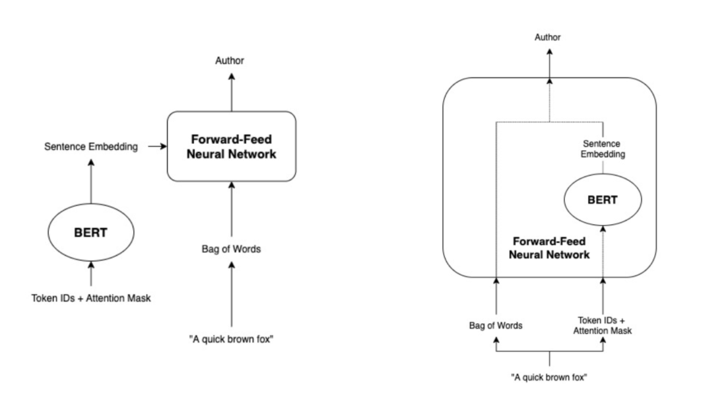

Natural language processing (NLP) is a super exciting field to be in right now. A large part of this is due to the introduction of attention-based architectures like BERT in the past few years (and more recently, GPT-3).

So what is BERT? In plain english it’s a fancy neural network that can figure out words based on **context**. 

Using it is also super simple thanks to huggingface’s [transformers](https://huggingface.co/), a popular NLP library that provides all flavours of pre-trained BERT models that are ready to use out of the box. In fact, it almost seems a bit boring because there’s nothing else to do except to feed it some data!

In this post, I will first detail how to use BERT the vanilla way for author identification on the Reuters_50_50 dataset and then how to use BERT in an end-to-end ensembling fashion for even better results. 

This post is aimed to be a practical guide on how to use BERT in a variety of ways on a classification task. For a more detailed write-up of the project itself, please refer to this [paper](https://github.com/drjosephliu/author_classification_project/blob/master/CIS530_Final_Project.pdf).

## Task

The task is a rather simple one: given an article, the model should correctly predict which author wrote it. Reuters_50_50 is a subset of Reuters Corpus Volume 1 (RCV1), which is a collection  of over 800,000 English language news stories dating from August 20, 1996 to August 19, 1997 that have been made available by Reuters, Ltd. This corpus was chosen because it has already been used in an author identification experiment by [Qian et al. (2017)](https://web.stanford.edu/class/archive/cs/cs224n/cs224n.1174/reports/2760185.pdf), who achieved a score of 62.7% using a GRU-based model. The dataset consists of 5000 stories by the top 50 authors (according to the number of stories written) with at least one subtopic of the class CCAT (corporate/industrial) selected to minimize the topic factor in distinguishing among texts. The train/test split is 50:50 with each set consisting of 2,500 texts (50 per author). However, in the same experiment by Qian et al. (2017), the dataset was reorganized into a 9:1 train/test split, so in order to benchmark our results accordingly, we will also follow suit.

## Vanilla BERT

There are tons of BERT models [out there](https://huggingface.co/transformers/pretrained_models.html) currently. They differ in their architecture and the kind of text they were trained on. In this tutorial, we’ll be using the standard BERT model trained on cased English text (`bert-base-cased`). The power of BERT is that it can be used for a variety of language tasks. It can be used to predict the next word, for answering questions and for text classification. Our use case is for classification, so we’ll be using `BertForSequenceClassification`. Even though the models are pre-trained out of the box, they still require some fine-tuning to be tailored to the task at hand (you can think of this as extra training). 

### Pre-Processing

There are a few steps required to prepare the data for fine-tuning. They boil down to:
1. Tokenising the input
2. Adding special tokens
3. Padding the input
4. Encoding the input from strings to integers
5. Creating the attention mask to be fed as additional input

```
def get_encodings(texts):
    token_ids = []
    for text in texts:
        token_id = tokenizer.encode(text, 
                                    add_special_tokens=True,
                                    truncation=True,
                                    max_length=MAX_LEN,
                                    pad_to_max_length=True)
        token_ids.append(token_id)
    return token_ids
```

In reality, the tokeniser that comes with each model handles steps 1-4, but we’ll go into more detail how each step is carried out as it will be important in understanding how to obtain the embedding vectors later on.

Tokenisation means breaking down words into chunks to make it easier for machines to understand. For example, `play` and `playing` both essentially mean the same thing, but to a machine they mean two completely different entities. Tokenisation breaks down a word like `playing` to `play` and `##ing`. With this breakdown, the machine can now understand that `playing` and `play` have similar meanings. 

After tokenisation, two special tokens, `[CLS]` and `[SEP]`, are added to the input sequence. `[CLS]` is inserted at the beginning of the input sequence and stands for classification. It is perhaps the most important token in our input. Later on when the sequence of tokens are fed into BERT, each token input to the model outputs an entire embedding vector. So the vector corresponding to the `[CLS]` token is special because it represents the context of the entire input text and it is the only token used for classification - the rest are actually discarded. 

The `[SEP]` token on the other hand, is inserted at the end of an input sequence and signals the end of the sequence. It is important for language tasks that require pairs of sequence inputs. Since our classification task only requires a single input sequence, it’s not really needed here.

The last special token is the `[PAD]` token. BERT requires each input sample to be of the same fixed length, so to account for varying input sequences, this token is used to pad the remaining space. BERT has a maximum allowable sequence length of 512 and the average token length for each article in the Reuters_50_50 dataset is over 1000 tokens long, with the longest just under 1700 tokens. So in actuality, our input texts will need to be truncated instead of padded. Even though we can set it to the default max, in my experience, 512 will use up tons of memory and give you the dreaded `CUDA: Out of memory` error. In this tutorial, we’ll opt to use 128 as it provides much faster training times without sacrificing too much accuracy. 

The next step is encoding. This step involves substituting the tokens with their token IDs as integers are easier to understand than strings for a machine. The last and final step is to create an attention mask for each input sequence. The attention mask consists of 1s and 0s and simply tells BERT whether or not to focus its attention in that spot, with 1 telling it to focus and 0 telling it to not focus.

```
def get_attention_masks(padded_encodings):
    attention_masks = []
    for encoding in padded_encodings:
        attention_mask = [int(token_id > 0) for token_id in encoding]
        attention_masks.append(attention_mask)
    return attention_masks
```

### Training

Now that the input data is processed, we’re almost ready to go. A quick word about optimisers, schedulers and other hyperparameters: huggingface provides some optimisers and schedulers to be used for BERT and the original BERT paper provides some hyperparameters they used. Feel free to play around with what gives you the best results, but for the sake of this tutorial, we’ll be sticking to the recommended hyperparameters, which are 4 epochs, batch size of 16 and a learning rate of 4e-5. Using these parameters, we comfortably Qian et al. with an accuracy of 74.4%.

## End-To-End BERT

The previous method made us look like geniuses, when really, all we did was plug everything in and press play. Not a single ounce of BERT, NLP or author identification knowledge required. Can we do better? With a little insight about text classification, it turns out we can and rather easily too. In this section, we’ll use BERT as an embedding layer within a neural network and feed in bag of words as an additional feature. We chose a bag of words because even though they’re quite primitive, they’ve still shown the ability to provide good numbers ([Soumya George and Joseph 2014](https://pdfs.semanticscholar.org/f432/cbc0e35e6560fc657ad6b490aa07ad901575.pdf)).

### Neural Network

The idea behind an ensemble method is to combine multiple different learning algorithms to obtain better performance than could be obtained from any of its constituents alone. Ensembling in our case, can be done in two ways: feeding the output as the input of another, or combining one model as a layer of another. This picture portrays what I mean:



In both cases, the outputted BERT embeddings combined with a bag of words are features to the model. The difference however, lies in the fact that the model on the right has BERT as one of its layers. Therefore, when the entire model is trained, it’s also trained taking into account the final classification task with the bag of words and hence, is end-to-end. On the other hand, the BERT model on the left isn’t trained with the final classification task taken into account and is therefore not end-to-end. With this in mind, it makes much more sense to go with an end-to-end ensemble model. 

This is done by setting BERT as one of the neural network’s layers. Sticking to the same ecosystem, our neural net architecture looks like this:
- 1 hidden layer with batch normalisation, dropout (p=0.5) and ReLU activation
- 1 output layer 

```
class NeuralNet(nn.Module):
    """
    End to end neural net that combines with BERT model
    """
    def __init__(self, bert_model):
        super().__init__()
        self.hidden1 = nn.Linear(815, 700)
        self.output = nn.Linear(700, 50)

        self.relu = nn.ReLU()
        self.dropout = nn.Dropout(p=0.5)
        self.batchnorm1 = nn.BatchNorm1d(700)
        self.bert = bert_model

    def forward(self, x):
        x = self.hidden1(x)
        x = self.batchnorm1(x)
        x = self.dropout(x)
        x = self.relu(x)

        x = self.output(x)
        return x
```

The dimensions of the input size is dependent on which BERT architecture you select. We’re going to use `bert-base-cased`, which outputs an embedding vector of size 768 for every token inputted. Because the max sequence length is 128, the model will output 128 vectors each of size 768. We’ll take the average of these vectors to return a single mean embedding vector. The dimensions of our bag of words on the other hand, will come out to 47. In order to combine the two vectors, we simply concatenate them to form a single vector of size `768+47 = 815`. 

### Bag of Words

Before we delve any further, let me first explain what is a bag of words and how we’re going to create it. A bag of words is simply the frequency of each word within a document. It’s very naive as it doesn’t tell us anything about the sequence these words are ordered in and hence, it lacks the ability to contextualise like BERT. Despite this however, it still does surprisingly well for certain tasks. If we simply count the frequency of each word without any added steps, then a few issues will be occur:
- Common words like `a`, `the`, `then`, `I`, don’t really tell us what the document is about, yet will dominate the frequency counts.
- Words like `play` and `playing`, which have similar meaning will be treated differently. 


With these considerations in mind, our process for creating a bag of words vector is:
1. Remove punctuation
2. Lemmatise verbs
3. Discard stopwords 

Thankfully, all these extra processing steps can be done rather pain-free with sklearn and nltk.

```
def punctuation_removal(x):
    temp = ""
    for i in x:
        if i not in string.punctuation:
            temp+=i
    return temp

def lemmatize(x):
    temp = ""
    for i in range(len(x.split())):
        lem = lemmatizer.lemmatize(x.split()[i], pos="v")
        temp += lem + " "
    temp = temp.rstrip()
    return temp

def stopword_removal(x):
    temp = ""
    for i in x.split():
        if i.lower() not in stopwords.words('english'):
            temp += i + " "
    temp = temp.rstrip()
    return temp
```

### Training

The final piece of the puzzle before we start training is to set up the optimiser and hyperparameters. Because we’ll be training the neural net and not the BERT model this time, we’ll stick to pytorch’s AdamW optimiser. The loss function will be cross entropy loss - even though this wasn’t specified last time, huggingface’s BERT model also uses cross entropy loss under the hood. This time we won’t be using a scheduler. As for hyperparameters, we’ll be opting with a learning rate of 1e-4 and 20 epochs. I’ve said it before and I’ll say it again - please perform proper cross-validation to discover the optimal hyperparameters! I neglect it completely in this tutorial as I want to keep it focused on practical ways of using BERT, but doesn’t mean you should!

Now that we’re ready to train, it’s time for the moment of truth. With our ensemble, we received an accuracy of 85.9%. Boom! Just like that, we were able to smash our previous best by more than 10%. And that’s just with a single added feature. Now you have the know-how to go absolutely mental with adding more and more features. Have fun!

Run the code on [colab](https://colab.research.google.com/drive/1aAwFti2TuGd6e7hre-yrf7-n2DkS7io8#scrollTo=hkpFpTiXIKXt).
